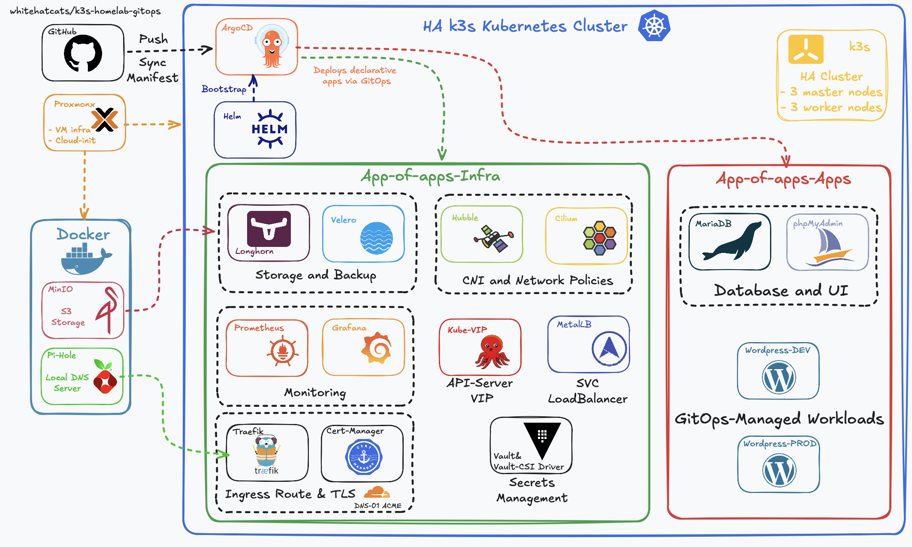

# k3s-homelab-gitops

This repository contains the **GitOps manifests** that define my self-hosted Kubernetes homelab.

*Figure 1: HA K3s GitOps Cluster Architecture — showing the App-of-Apps structure (Infra + Apps), external Docker-based services, and the underlying Proxmox virtualized environment.*

All applications and infrastructure are deployed and managed through **Argo CD**, following a fully declarative approach.  
The stack includes components such as Traefik, Vault, Longhorn, cert-manager, and more, representing hands-on DevOps practices applied to real infrastructure.

For a complete overview, documentation, and technical write-ups, visit my portfolio:

**Portfolio:** [daniellincu.dev](https://daniellincu.dev)

